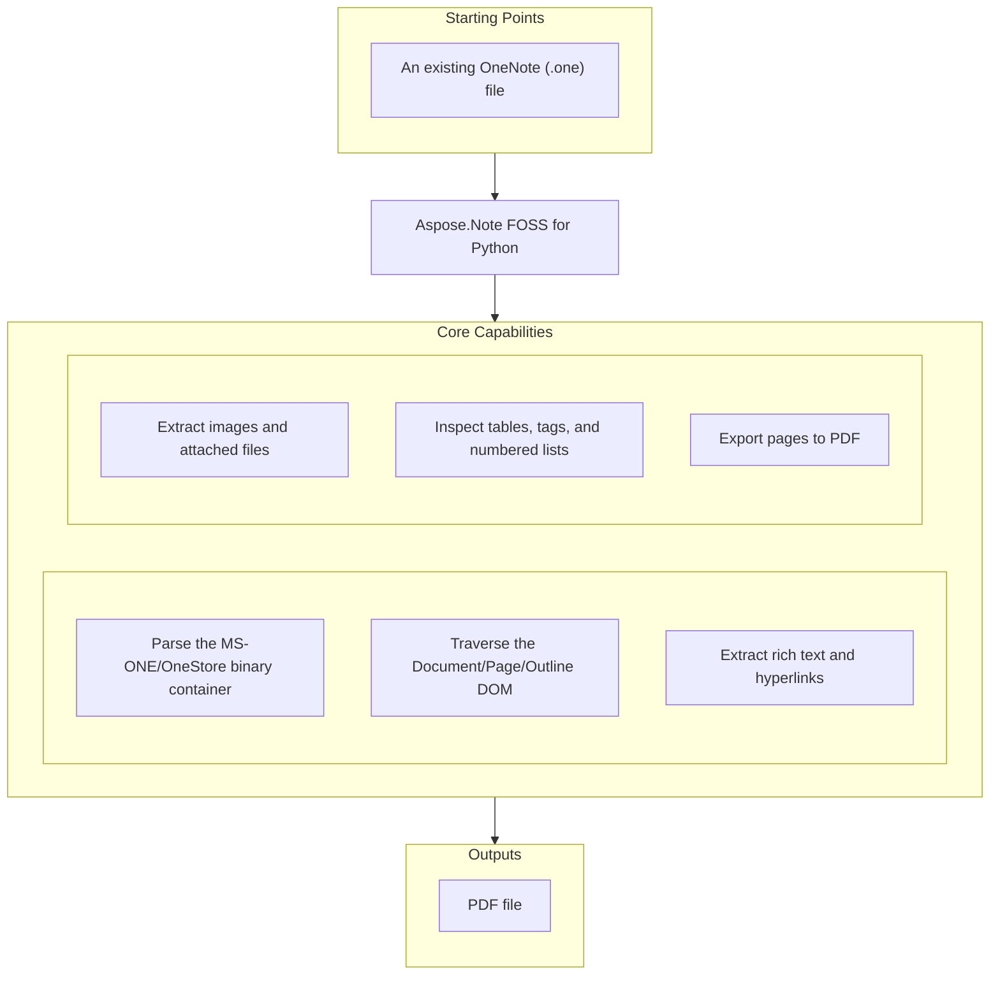

# Aspose.Note FOSS for Python

[](https://pypi.org/project/aspose-note/) [](https://pypi.org/project/aspose-note/) [](LICENSE) [](https://github.com/aspose-note-foss/Aspose.Note-FOSS-for-Python/actions/workflows/ci.yml)

[](https://products.aspose.org/note/python/)

Aspose.Note FOSS for Python is a free, open-source Python library for working with Microsoft
OneNote `.one` files. It gives Python programs read access to OneNote notebooks — pages, rich
text, images, attachments, tables, tags, and numbered lists — and can export pages to PDF, with
no Microsoft OneNote installation or COM automation involved.

## Navigation

- [At a Glance](#at-a-glance)
- [Key Capabilities](#key-capabilities)
- [Installation](#installation)
- [Quick Start](#quick-start)
- [Additional Examples](#additional-examples)
- [API Reference](#api-reference)
- [Documentation & Resources](#documentation--resources)
- [Scope and Limitations](#scope-and-limitations)
- [Development and Testing](#development-and-testing)
- [License](#license)

## At a Glance



## Key Capabilities

- Parse a `.one` file from a path or a binary stream into an Aspose.Note-compatible DOM via `Document`, with no dependency on Microsoft OneNote or COM automation.
- Traverse the parsed document as a tree of `Page`, `Outline`, `OutlineElement`, `RichText`, `Image`, `Table`, and `AttachedFile` nodes, using `CompositeNode.GetChildNodes()` for type-based search or the `DocumentVisitor` pattern for full traversal.
- Read page metadata through `Page.Title`, `Page.Author`, `Page.CreationTime`, and `Page.Level`, plus revision history via `PageHistory` and `Document.GetPageHistory()`.
- Extract rich text with per-run formatting through `TextRun` and `TextStyle` (bold, italic, underline, strikethrough, superscript, subscript, font, color, hyperlinks) and paragraph-level styling via `RichText.ParagraphStyle`.
- Extract embedded images through `Image` (bytes, file name, dimensions, alignment) and attached files through `AttachedFile` (bytes, file name), ready to save straight to disk.
- Inspect tables through `Table`, `TableRow`, `TableCell`, and `TableColumn` (rows, cells, and their content); OneNote tags through `NoteTag` (yellow star, question mark, musical note, and custom tags) attached to text, images, and tables; and numbered lists through `NumberList`.
- Export pages to PDF through `PdfSaveOptions` (`Document.Save(target, SaveFormat.Pdf)`), tuning image compression, JPEG quality, and page range.

## Installation

```bash
pip install aspose-note
```

PDF export needs the optional `pdf` extra, which pulls in [ReportLab](https://pypi.org/project/reportlab/):

```bash
pip install "aspose-note[pdf]"
```

Requires Python 3.10 or later. The published PyPI distribution and the import package share the
same name, `aspose.note` — `from aspose.note import Document`.

## Dependencies

### Required Package Dependencies

No required third-party package dependencies.

### Optional Dependencies

- `reportlab` — pulled in by the `pdf` extra (`pip install "aspose-note[pdf]"`); required only to export pages to PDF via `Document.Save(..., SaveFormat.Pdf)`.
- `pypdf`, `Pillow`, `PyMuPDF` — pulled in by the `test-pdf` extra; used by the PDF golden-output tests to compare generated PDFs against stored manifests, not by the library at runtime.

### Native and System Requirements

- Requires Python 3.10 or later.

### Development Dependencies

- `build`, `twine` — used to build and publish the package release; not needed to use or test the library.

## Quick Start

Load a `.one` file, print its display name, and walk its pages:

```python
from aspose.note import Document

doc = Document("SimpleTable.one")
print(doc.DisplayName)
for page in doc:
    print(page.Title.TitleText.Text)
```

Export the same document to PDF:

```python
from aspose.note import Document, SaveFormat

doc = Document("SimpleTable.one")
doc.Save("out.pdf", SaveFormat.Pdf)
```

## Additional Examples

More real, runnable scripts are available in [`examples/`](examples/). The most illustrative one
beyond Quick Start is saving every embedded image to disk.

### Save Embedded Images to Disk

```python
from pathlib import Path
from aspose.note import Document, Image

out_dir = Path("out_images")
out_dir.mkdir(exist_ok=True)

doc = Document("3ImagesWithDifferentAlignment.one")
for i, img in enumerate(doc.GetChildNodes(Image), start=1):
    name = img.FileName or f"image_{i}.png"
    (out_dir / name).write_bytes(img.Bytes)
```

<details>
<summary>View Additional Examples</summary>

### Load From a Binary Stream

```python
from aspose.note import Document

with open("SimpleTable.one", "rb") as f:
    doc = Document(f)
print(doc.DisplayName, len(list(doc)))
```

### Traverse Tables (Rows and Cells)

```python
from aspose.note import Document, Table, TableRow, TableCell, RichText

doc = Document("SimpleTable.one")
for table in doc.GetChildNodes(Table):
    for row in table.GetChildNodes(TableRow):
        cells = row.GetChildNodes(TableCell)
        values = [" ".join(rt.Text for rt in cell.GetChildNodes(RichText)) for cell in cells]
        print(values)
```

### Extract Attached Files

```python
from pathlib import Path
from aspose.note import Document, AttachedFile

doc = Document("OnePageWithFile.one")
for i, af in enumerate(doc.GetChildNodes(AttachedFile), start=1):
    name = af.FileName or f"attachment_{i}.bin"
    Path(name).write_bytes(af.Bytes)
```

### Inspect OneNote Tags

```python
from aspose.note import Document, RichText

doc = Document("TagSizes.one")
for rt in doc.GetChildNodes(RichText):
    for tag in rt.Tags:
        print(tag.Label, tag.Status)
```

### Count Nodes With a DocumentVisitor

```python
from aspose.note import Document, DocumentVisitor, Page, Image, RichText

class Counter(DocumentVisitor):
    def __init__(self):
        self.pages = 0
        self.rich_texts = 0
        self.images = 0

    def VisitPageStart(self, page: Page) -> None:
        self.pages += 1

    def VisitRichTextStart(self, rich_text: RichText) -> None:
        self.rich_texts += 1

    def VisitImageStart(self, image: Image) -> None:
        self.images += 1

doc = Document("3ImagesWithDifferentAlignment.one")
counter = Counter()
doc.Accept(counter)
print(counter.pages, counter.rich_texts, counter.images)
```

### Extract All Text

```python
from aspose.note import Document, RichText

doc = Document("FormattedRichText.one")
texts = [rt.Text for rt in doc.GetChildNodes(RichText)]
print("\n".join(texts))
```

### Export to PDF With Custom Options

```python
from aspose.note import Document, SaveFormat
from aspose.note.saving import PdfSaveOptions

doc = Document("TagSizes.one")
opts = PdfSaveOptions(JpegQuality=90)
doc.Save("out.pdf", opts)
```

### Extract Hyperlinks

```python
from aspose.note import Document, RichText

doc = Document("FormattedRichText.one")
for rt in doc.GetChildNodes(RichText):
    for run in rt.TextRuns:
        if run.Style.IsHyperlink and run.Style.HyperlinkAddress:
            print(run.Text, "->", run.Style.HyperlinkAddress)
```

### Inspect Numbered Lists

```python
from aspose.note import Document, OutlineElement

doc = Document("NumberedListWithTags.one")
for oe in doc.GetChildNodes(OutlineElement):
    nl = oe.NumberList
    if nl is None:
        continue
    print("format=", nl.Format, "number_format=", nl.NumberFormat, "restart=", nl.Restart)
```

</details>

## API Reference

The primary entry point is `Document`, which loads a `.one` file and exposes its pages as a tree
of `Page`, `Outline`, `OutlineElement`, `RichText`, `Image`, `Table`, and `AttachedFile` nodes;
`Document.Save()` is the sole write path, currently limited to PDF via `PdfSaveOptions`. The
supported public entry points are `aspose.note` and `aspose.note.saving` — everything under
`aspose.note._internal` is an implementation detail and may change.

<details>
<summary>View the Supported Public API Surface</summary>

### Core API

| Class | Description |
|---|---|
| `AsposeNoteError` | Base exception for the library; all other library exceptions inherit from it. |
| `AttachedFile` | A file attached to a page — exposes its raw `Bytes`, `FileName`, and `Tags`. |
| `CompositeNode` | Base class for every container node (`Document`, `Page`, `Table`, ...); provides child-node access and `GetChildNodes()`. |
| `Document` | The root DOM object — loads a `.one` file or stream, exposes its `Page` children, and is the sole `Save()` entry point. |
| `DocumentVisitor` | Base visitor class for traversing the DOM via `Visit*Start`/`Visit*End` callbacks. |
| `FileCorruptedException` | Raised when the source file's OneStore container is malformed. |
| `Image` | An embedded image — bytes, file name, dimensions, alignment, and OneNote tags. |
| `IncorrectDocumentStructureException` | Raised when the parsed OneStore object graph doesn't match the expected document structure. |
| `IncorrectPasswordException` | Raised when `LoadOptions.DocumentPassword` is supplied — password-protected documents are not supported. |
| `License` | Compatibility surface for the commercial licensing API; see Scope and Limitations. |
| `LoadOptions` | Options passed to `Document()` — `DocumentPassword` and `LoadHistory`. |
| `Metered` | Compatibility surface for the commercial metered-licensing API; see Scope and Limitations. |
| `Node` | Base class for every DOM node — `ParentNode`, `Document`, and `Accept()`. |
| `NoteTag` | A OneNote tag (yellow star, question mark, musical note, or custom) attached to text, images, or tables. |
| `NumberList` | Numbered-list formatting applied to an `OutlineElement`. |
| `Outline` | A positioned container of `OutlineElement` nodes on a page. |
| `OutlineElement` | A single outline item — may hold `RichText`, `Image`, `Table`, or nested content, plus an optional `NumberList`. |
| `Page` | A single OneNote page — title, author, timestamps, level, and revision history. |
| `PageHistory` | The ordered revision history for a `Page`, returned by `Document.GetPageHistory()`. |
| `ParagraphStyle` | Default paragraph-level text formatting used by `RichText.ParagraphStyle`. |
| `RichText` | A run of formatted text content — `Text`, `TextRuns`, alignment, and tags. |
| `Table` | A table on a page — columns, border visibility, and tags. |
| `TableCell` | A single cell within a `TableRow`, holding rich text, images, or nested content as child nodes. |
| `TableColumn` | A table column's width and lock state. |
| `TableRow` | A row within a `Table`, containing one `TableCell` per column. |
| `TextRun` | A single formatted run within `RichText.Text` — `Text` plus its `TextStyle`. |
| `TextStyle` | Character-level formatting — bold, italic, underline, font, color, hyperlink, and more. |
| `Title` | A page's title — `TitleText`, `TitleDate`, and `TitleTime`, each a `RichText`. |
| `UnsupportedFileFormatException` | Raised when the source isn't a recognized OneNote format; carries the detected `FileFormat`. |
| `UnsupportedSaveFormatException` | Raised by `Document.Save()` for anything other than `SaveFormat.Pdf`. |

#### Enumerations

| Enumeration | Description |
|---|---|
| `FileFormat` | The detected OneNote source format (`Unknown`, `OneNote2010`, `OneNoteOnline`, `OneNote2007`). |
| `HorizontalAlignment` | Horizontal text/image alignment (`Left`, `Center`, `Right`). |
| `NodeType` | The DOM node kind used by `CompositeNode.GetChildNodes(node_type)`. |
| `SaveFormat` | The output format accepted by `Document.Save()` — currently only `Pdf`. |
| `TagStatus` | A `NoteTag`'s completion state (`Open`, `Completed`, `Disabled`). |

---

### Saving

| Class | Description |
|---|---|
| `AttachmentTagFlowable` | Internal ReportLab `Flowable` that lays out an attachment's tag icon in the generated PDF. |
| `OutlinePrefixFlowable` | Internal ReportLab `Flowable` that lays out an outline element's numbered-list prefix in the generated PDF. |
| `PdfSaveOptions` | Options for PDF export — image compression, JPEG quality, page settings, and page range. |
| `SaveOptions` | Abstract base for save-options types; exposes `SaveFormat`, `PageIndex`, `PageCount`, `FontsSubsystem`. |

---

#### Detailed Member Reference

### Document and Traversal

- `Document(source=None, load_options=None)`
  - `DisplayName: str | None`, `CreationTime: datetime | None`
  - `FileFormat -> FileFormat` — always reports `OneNote2010`, see Scope and Limitations
  - iteration: `for page in doc: ...`
  - `GetPageHistory(page) -> PageHistory`
  - `DetectLayoutChanges()` — compatibility stub, see Scope and Limitations
  - `Save(target, format_or_options=None)` — `SaveFormat.Pdf` only
- `PageHistory`
  - `Current: Page`, `Count: int`, `IsReadOnly: bool`
  - `Add(page)`, `AddRange(pages)`, `Remove(page)`, `RemoveAt(index)`, iteration/indexing
- `DocumentVisitor` — base visitor:
  - `VisitDocumentStart/End`, `VisitPageStart/End`, `VisitTitleStart/End`, `VisitOutlineStart/End`, `VisitOutlineElementStart/End`, `VisitRichTextStart/End`, `VisitImageStart/End`
- `Node`
  - `ParentNode: Node | None`, `Document: Document | None`, `Accept(visitor)`
- Container nodes (`Document`, `Page`, `Title`, `Outline`, `OutlineElement`, `Image`, `Table`, `TableRow`, `TableCell`)
  - `FirstChild`, `LastChild`
  - `AppendChildLast(node)`, `AppendChildFirst(node)`, `InsertChild(index, node)`, `RemoveChild(node)`
  - iteration `for child in node: ...`
  - `GetChildNodes(node_type) -> list[TNode]` — recursive search by type

### Document Structure

- `Page`
  - `Title: Title | None`, `Author: str | None`
  - `CreationTime: datetime | None`, `LastModifiedTime: datetime | None`, `Level: int | None`
  - `Clone(cloneHistory=False) -> Page`
- `Title`
  - `TitleText: RichText | None`, `TitleDate: RichText | None`, `TitleTime: RichText | None`
- `Outline`
  - `HorizontalOffset`, `VerticalOffset`, `MaxWidth`, `MaxHeight`, `MinWidth`, `ReservedWidth`, `IndentPosition`, `DescendantsCannotBeMoved`, `LastModifiedTime`
- `OutlineElement`
  - `NumberList: NumberList | None`

### Content

- `RichText(Node)`
  - `Text: str`, `TextRuns: list[TextRun]`, `ParagraphStyle: ParagraphStyle`, `Length: int`
  - `Alignment: HorizontalAlignment | None`, `Tags: list[NoteTag]`
  - `Append(text, style=None)`, `Insert(index, text, style=None)`, `Remove(start, count)`, `Replace(old_value, new_value, style=None)`, `Trim()`/`TrimStart()`/`TrimEnd()`, `IndexOf(value, startIndex, count, comparison) -> int`
- `TextRun`
  - `Text: str`, `Style: TextStyle`
- `ParagraphStyle`
  - default paragraph-level text formatting; `ParagraphStyle.Default() -> ParagraphStyle`
- `TextStyle`
  - `IsBold/IsItalic/IsUnderline/IsStrikethrough/IsSuperscript/IsSubscript: bool`, `IsHidden: bool`, `IsMathFormatting: bool`
  - `FontName: str | None`, `FontSize: float | None`, `FontColor: int | None`, `Highlight: int | None`, `Language: int | None`
  - `IsHyperlink: bool`, `HyperlinkAddress: str | None`, `FontStyle: int`
  - `TextStyle.Default()`, `.DefaultMsOneNoteTitleTextStyle()`, `.DefaultMsOneNoteTitleDateStyle()`, `.DefaultMsOneNoteTitleTimeStyle()`
- `Image`
  - `FileName: str | None`, `Bytes: bytes`, `Width`, `Height`
  - `AlternativeTextTitle`, `AlternativeTextDescription`, `HyperlinkUrl`, `Tags: list[NoteTag]`
  - `Replace(image) -> None`
- `AttachedFile(Node)`
  - `FileName: str | None`, `Bytes: bytes`, `Tags: list[NoteTag]`
- `Table`
  - `Columns: list[TableColumn]`, `IsBordersVisible`, `Tags: list[NoteTag]`
- `TableColumn`
  - `Width: float | None`, `LockedWidth: bool`
- `NoteTag`
  - `Label`, `Icon`, `Status: TagStatus`, `Highlight`, `CreationTime`, `CompletedTime`, `FontColor`
  - `NoteTag.CreateYellowStar(label)`, `.CreateQuestionMark(label)`, `.CreateMusicalNote(label)`
- `NumberList`
  - `Format`, `NumberFormat`, `Font`, `FontSize`, `FontColor`, `IsBold`, `IsItalic`, `Restart`
  - `GetNumberedListHeader(number) -> str`

### Load and Save Options

- `LoadOptions`
  - `DocumentPassword: str | None` — not supported, see Scope and Limitations
  - `LoadHistory: bool`
- `SaveOptions` (base)
  - `SaveFormat: SaveFormat`, `PageIndex: int`, `PageCount: int | None`, `FontsSubsystem`
- `PdfSaveOptions(SaveOptions)`
  - `ImageCompression`, `JpegQuality`, `PageSettings`, `PageSplittingAlgorithm`

### Licensing

- `License.SetLicense(license_path_or_stream)` — no-op in this edition, see Scope and Limitations
- `Metered.SetMeteredKey(public_key, private_key)` — no-op in this edition, see Scope and Limitations

### Enumerations

- `FileFormat`: `Unknown`, `OneNote2010`, `OneNoteOnline`, `OneNote2007`
- `SaveFormat`: `Pdf`
- `HorizontalAlignment`: `Left`, `Center`, `Right`
- `NodeType`: `Document`, `Page`, `Outline`, `OutlineElement`, `RichText`, `Image`, `Table`, `AttachedFile`
- `TagStatus`: `Open`, `Completed`, `Disabled`

### Exceptions

All inherit from `AsposeNoteError`.

- `AsposeNoteError` — base exception for the library
- `FileCorruptedException` — the OneStore container is malformed
- `IncorrectDocumentStructureException` — the parsed object graph doesn't match the expected structure
- `IncorrectPasswordException` — a password was supplied; password-protected documents aren't supported
- `UnsupportedFileFormatException` — the source isn't a recognized OneNote format (carries `FileFormat`)
- `UnsupportedSaveFormatException` — `Document.Save()` was called with anything other than `SaveFormat.Pdf`

</details>

## Documentation & Resources

- **[Getting started guide](https://docs.aspose.org/note/python/)** — installation, walkthroughs, and feature guides for this library.
- **[How-to guides & FAQ](https://kb.aspose.org/note/python/)** — task-focused answers for common OneNote-parsing questions.
- **[Full API reference](https://reference.aspose.org/note/python/)** — the complete, browsable reference for all 39 public types (the [API reference](#api-reference) section above covers the essentials).
- Found a bug or have a feature request? [Open an issue](https://github.com/aspose-note-foss/Aspose.Note-FOSS-for-Python/issues) on GitHub.

## Scope and Limitations

- Writing back to `.one` is not implemented — this library only reads OneNote files.
- `LoadOptions.DocumentPassword` / encrypted documents are not supported — supplying a password raises `IncorrectPasswordException`.
- `SaveFormat` currently declares only `Pdf` — `Document.Save()` raises `UnsupportedSaveFormatException` for any other format or options object.
- `License.SetLicense()` and `Metered.SetMeteredKey()` are present for API-shape compatibility with the commercial product but are no-ops in this edition — no license is required to use this library.
- `DetectLayoutChanges()` is a compatibility stub and performs no layout computation.

These limitations don't apply to
[Aspose.Note — Enterprise Edition](https://products.aspose.com/note/), the
full-featured Aspose product — it adds full read/write support (including writing OneNote files
back out), broader format conversion, and wider OneNote compatibility beyond what this free
edition covers.

## Development and Testing

Clone the repository and install the package together with the test extras used in CI:

```bash
git clone https://github.com/aspose-note-foss/Aspose.Note-FOSS-for-Python.git
cd Aspose.Note-FOSS-for-Python
python -m pip install -e ".[pdf,test-pdf]"
```

Run the unit test suite the same way [`ci.yml`](.github/workflows/ci.yml) does:

```bash
python -m unittest tests.test_imports_smoke -v
python -m unittest tests.test_aspose_note_compat_smoke -v
python -m unittest tests.test_aspose_note_dom_content -v
python -m unittest tests.test_aspose_note_dom_document -v
python -m unittest tests.test_aspose_note_exceptions_and_stubs -v
python -m unittest tests.test_aspose_note_richtext_formatting -v
python -m unittest tests.test_aspose_note_save_options -v
python -m unittest tests.test_aspose_note_tags -v
```

<details>
<summary>PDF Golden Tests and Example Scripts</summary>

The PDF golden-output tests (`tests.test_aspose_note_pdf_goldens`) compare generated PDFs against
manifests in `tests/goldens/pdf/`, not raw bytes, so they stay stable across platforms and
ReportLab internals. The PDF writer uses deterministic Base-14 fonts by default; set
`ASPOSE_NOTE_PDF_USE_SYSTEM_FONTS=1` before export if you want to try Windows system fonts for
local inspection instead:

```bash
python -m unittest tests.test_aspose_note_pdf_goldens -v
```

On a mismatch, the generated PDFs and manifests are written to
`tests/out/pdf_golden_failures/` for inspection. If `PyMuPDF` is installed, the failing test also
renders baseline/generated pages to PNG and writes visual diff artifacts into the same output
tree; if `PyMuPDF` is unavailable but `pdftoppm` is on `PATH`, the tests fall back to `pdftoppm`
as the renderer.

Regenerate the golden baselines after an intentional PDF-output change with
[`tools/regenerate_pdf_goldens.py`](tools/regenerate_pdf_goldens.py):

```bash
python tools/regenerate_pdf_goldens.py
```

Regenerate only selected cases:

```bash
python tools/regenerate_pdf_goldens.py --case formatted_richtext --case simple_table
```

Runnable example scripts have their own setup and usage notes in
[`examples/README.md`](examples/README.md).
[`publish-pypi.yml`](.github/workflows/publish-pypi.yml) shows the exact release-time commands
this project runs in CI.

</details>

## License

This project is licensed under the [MIT License](LICENSE). The MIT License permits use, copying,
modification, distribution, sublicensing, and commercial use, provided its copyright and
permission notice are retained. The software is provided without warranty. The optional PDF-export
dependency, [ReportLab](https://pypi.org/project/reportlab/), is BSD-3-Clause licensed; see
[THIRD_PARTY_NOTICES.md](THIRD_PARTY_NOTICES.md) for the full text.
